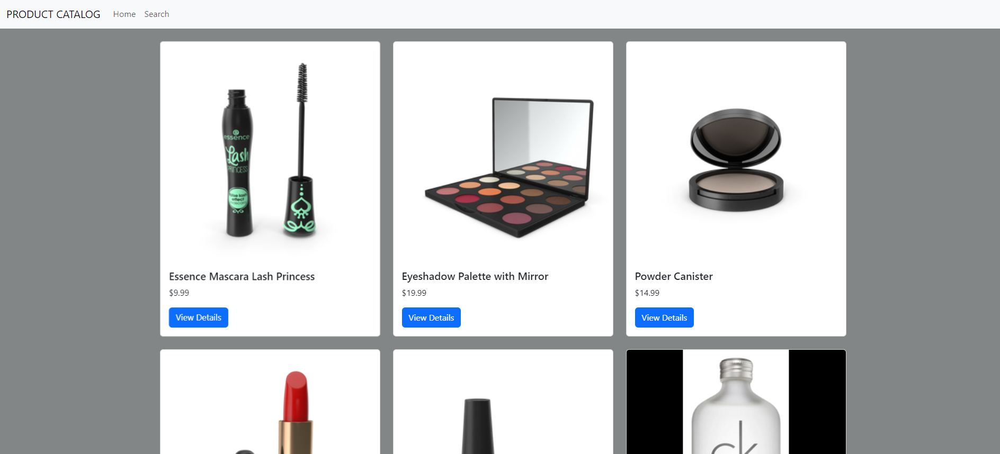
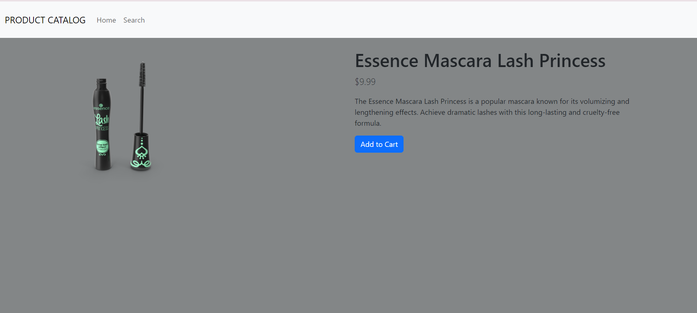
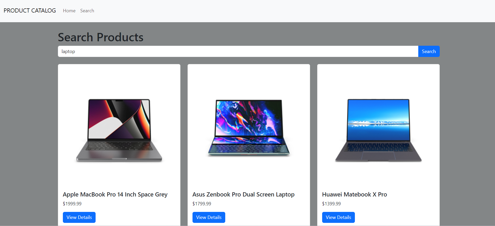

# Product Catalog Viewer

Product Catalog Viewer is a React application that allows users to browse a list of products, view detailed information, and search for specific products. This application uses the [DummyJSON API](https://dummyjson.com/docs/products) to fetch product data.

## Features

- **Products List (Home Page)**: Displays a paginated list of products with basic information, such as product name, image, and price.
- **Product Details (Details Page)**: Allows users to click on a product in the list to view additional details on a new page.
- **Product Search (Search Page)**: Provides a search feature for users to search for products.

## Screenshots


*Product List Page*



*Product Details Page*



*Product Search Page*

## Getting Started

### Prerequisites

- Node.js and npm installed on your machine.
- Git for version control.

### Installation

1. Clone the repository:

   ```bash
   git clone https://github.com/yourusername/product-catalog-viewer.git

2. Navigate the project directory:

    ```bash
    cd product-catalog-viewer

3. Install Dependencies:

   ```bash
    npm install

## Running the Application

To start the development server run:
npm install

The application will be available at http://localhost:3000.
## Deployment

The application has been successfully deployed using Netlify. You can access the deployed version at:

[https://afsharather-product-catalog.netlify.app/](https://afsharather-product-catalog.netlify.app/)


